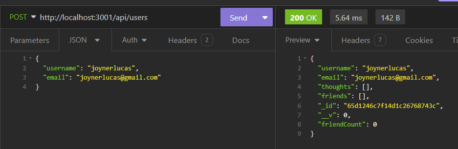
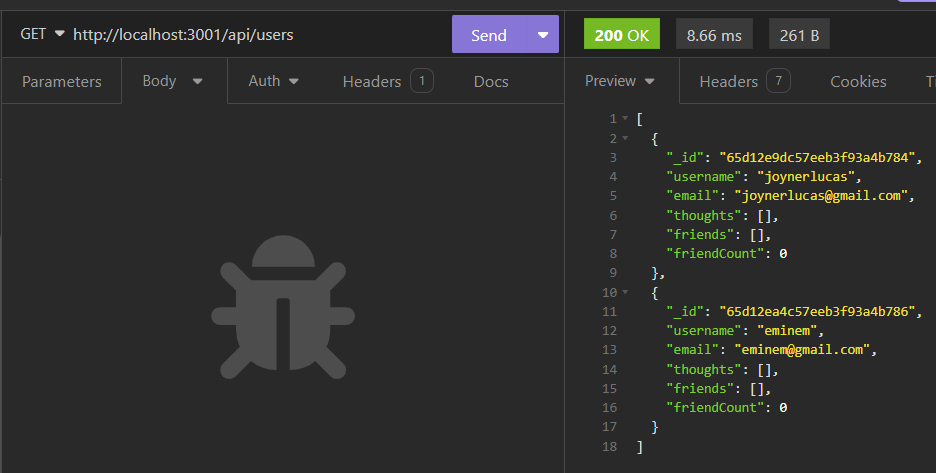
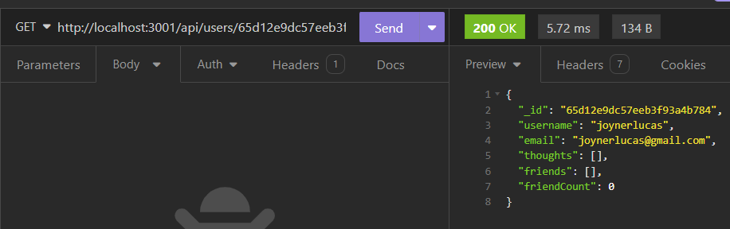
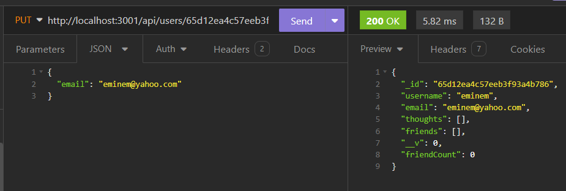
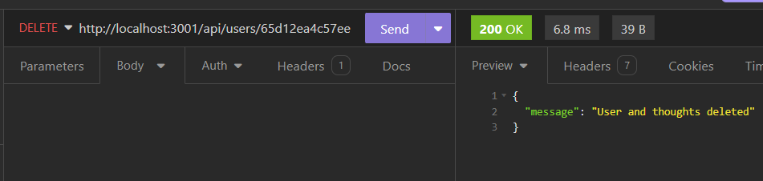

# NoSQL Social Network API

## Description
This social network application API allows users to add friends, post their thoughts, and react to their friends’ thoughts. Express.js was used for routing, and MongoDB database and Mongoose ODM were used for storing the data.

## Table of Contents
1. [Usage](#usage)
2. [Instructions](#instructions)
3. [Links](#links)
4. [Acknowledgements](#acknowledgements)
5. [Author](#author)

## Usage
Since this is a backend web application, you must have node.js installed on your machine. You will also need a package.json with the required dependencies. Before installing dependencies, run "npm init" to create a package.json file. Also before installing npm dependencies, make sure you have a .gitignore file that includes node_modules/ and .DS_Store/. Then run "npm i" to install dependencies. 

To initialize the social network web API, type "npm run start" in the command line. Use a program like Insomnia to test your routes.

The images below show sample routes for users in Insomnia (see the video walkthrough to view all routes):

- Sample post route for creating a new user:

- Sample get Routes for getting all users:

- Sample get Route for getting a single user by ID:

- Sample put route for updating a user by ID

- Sample delete route for deleting a user by ID:

## Instructions
1. Clone the repository to your machine
2. Copy the files to your own repository
3. Conduct the git add, commit, and push commands to update your repository with the copied files
4. Follow the Usage instructions above to install necessary dependencies.
5. Modify the code to meet your needs
6. Commit and push your changes

## Links
- [GitHub Repository](https://github.com/hwoolford/nosql-social-network-api) 
- [Walkthrough Video Demonstration]()

## Acknowledgements
- [Mastering Email Validation in Mongoose: Syntax, Uniqueness, and Beyond](https://blog.bounceless.io/mastering-email-validation-in-mongoose-syntax-uniqueness-and-beyond/): Code used to validate email addresses in Mongoose

- I would like to acknowledge the assistance provided by Xpert, an AI Learning Assistant, in providing guidance and support throughout the development of this project. Xpert's insights and suggestions were invaluable in helping me overcome challenges and improve the quality of my work. (Acknowledgement written by Xpert)

## Author
My name is Heather Woolford and I am a student learning full stack web development at the University of New Hampshire.
[Find Me on GitHub](https://gist.github.com/hwoolford)